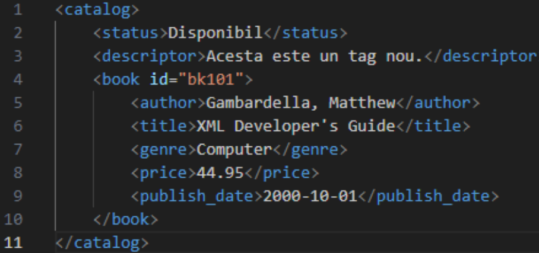
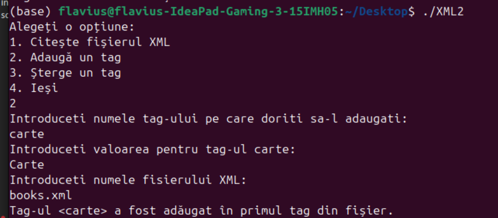
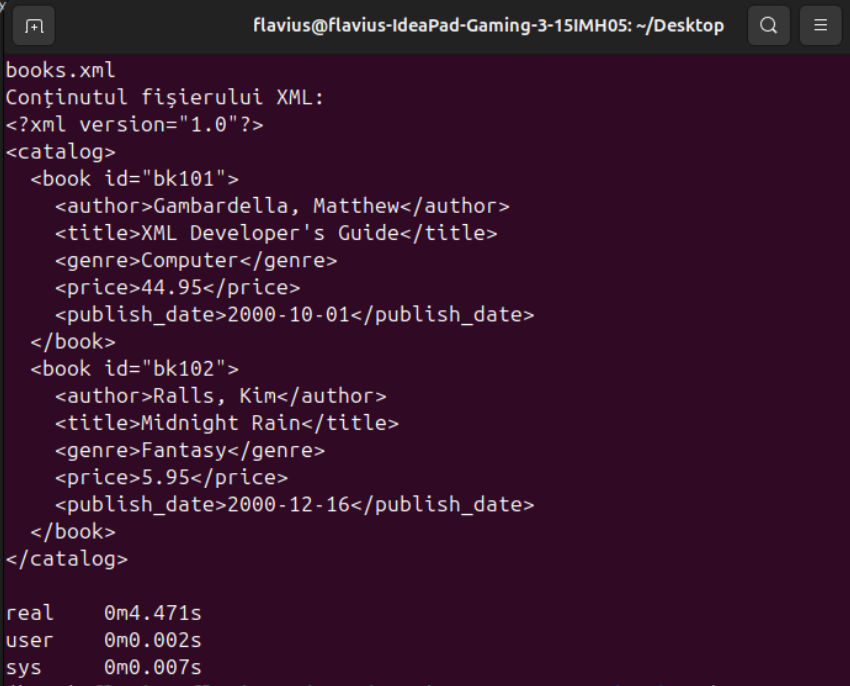

# XMLParser
Problema constă în scrierea unui program (script) shell care să se ocupe cu parsarea fișierelor XML pentru a citi și scrie date din, respectiv în, format XML. Fișierele XML au o utilizare mare în stocarea și transferul datelor, fiind ușor de procesat. Crearea unui parser simplu este importantă pentru a gestiona ușor fișiere fără a utiliza limbaje de programare mai avansate. 

    Vor fi abordate următoarele capitole în cadrul raportului:
- Descrierea problemei. Specificarea soluției
- Design și implementare
- Evaluarea soluției
- Concluzii

Contextul general al problemei constă în manipularea datelor structurate, automatizarea procesării fișierelor XML și asigurarea accesibilității soluției pentru toți utilizatorii, inclusiv pentru cei cu puține cunoștințe de programare. Obiectivul principal este de a crea un script shell care să ofere funcționalitățile de bază (citire și scriere) ale tipului de fișiere precizat anterior.

Soluția oferită se bazează pe utilizarea comenzii xmlstarlet, un utilitar puternic pentru procesarea fișierelor XML. Acesta permite citirea, modificarea și validarea fișierelor XML din linia de comandă, ceea ce îl face ideal pentru integrarea în scripturi shell. Printre funcționalități se enumeră citirea fișierului XML, ștergerea unui tag XML și, în plus, adăugarea unui tag XML. 

Evaluarea se face prin intermediul meniului programului. În funcție de ce dorește utilizatorul să realizeze, este pus să precizeze fișierul XML căruia să-i atribuie modificările sau afișările. Dacă, în urma adăugării sau ștergerii, fișierul este modificat, iar dacă în urma citirii, fișierul este afișat în consolă, atunci programul funcționează corespunzător și afișează un mesaj de succes pe ecran.

    Citirea datelor dintr-un fișier XML:
- Comanda utilizată este xmlstarlet fo “$file”.
- Se citește fișierul XML și îl formatează pentru afișare într-un mod lizibil.
- De exemplu, dacă fișierul catalog.xml este dat, comanda va afișa conținutul acestuia într-un format
ordonat.

    Ștergerea unui tag specific:
- Comanda utilizată este xmlstarlet ed -d "//$tag_name" "$file" > "$file.tmp".
- -d "//$tag_name" identifică nodurile cu numele $tag_name din întreaga structură XML și le șterge.
- De exemplu, dacă utilizatorul introduce tag_name, toate nodurile tag_name vor fi eliminate.
Adăugarea unui tag specific:
- S-a utilizat comanda xmlstarlet ed -s "/*[1]" -t elem -n "$tag_name" -v "$tag_value" "$file".
-s "/*[1]": Adaugă un nou copil în primul tag.
-t elem: Specifică faptul că adăugăm un element XML.
-n "$tag_name": Numele noului tag, introdus de utilizator.
-v "$tag_value": Valoarea noului tag, introdusă de utilizator.

Arhitectura este bazată pe un sistem local de operare Linux, care gestionează fișiere XML și le manipulează folosind scripturi shell. Componenta software principală este un script Bash care interacționează cu fișierele XML prin xmlstarlet. Arhitectura hardware este reprezentată de un sistem cu o unitate centrală de procesare (CPU), memorie RAM și stocare locală. Este esențială pentru rularea scripturilor Bash si manipularea fișierelor XML. Fișierele sunt stocate pe discul local și pot fi accesate și modificate direct prin intermediul scripturilor. A fost utilizat un calculator cu 16 GB RAM, conectat la internet wireless pentru descărcarea utilitarului xmlstarlet. Mai mult decât atât, s-a utilizat și o mașină virtuală cu două nuclee din procesorul fizic, 4 GB RAM din cele 16 GB, stocare virtualizată și rețea virtualizată (bridge) pentru accesul la internet. Sistemul de operare gazdă folosește Linux, la fel ca mașina virtuală, unde s-a utilizat și un software de gestionare a resurselor.

Proiectul demonstrează eficiența unui script pentru manipularea fișierelor XML, având o performanță bună pentru fișiere de dimensiuni medii. Au fost rezolvate majoritatea problemelor tehnice care puteau interfera cu buna funcționare a programului. Testele efectuate au arătat că scriptul poate fi utilizat pentru gestionarea fișierelor XML în diverse condiții nu foarte favorabile, însă pentru fișiere foarte mari ar fi necesare niște optimizări suplimentare.